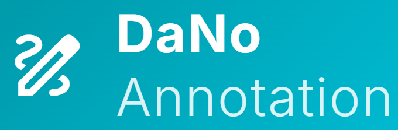

# DaNo Data Annotation Tool

  

A high-performance, web-based data annotation tool tailored for machine vision and surface defect detection. Inspired by the native UnitX CorteX/DaNo Label Editor, this lightweight app enables rapid polygon, brush, and eraser-based pixel-level labeling.

## Key Features

- **Native File System Access**: Open local folders directly in the browser. No slow uploads or manual syncing to a central server required.
- **Advanced Output Formatting**: 
  - Labels are seamlessly converted and saved natively to your hard drive as `.npy` NumPy binary mask arrays.
  - Automatically structures labels by creating a `[Defect Name]/` folder containing merged class masks, and a `[Defect Name]-single/` folder separating completely disjoint blobs into individual numbered mask arrays natively.
- **Precision Tools**: Polygon tool with fast-close (Right Click) and Undo node (Z), alongside classic Brush and Eraser tools.
- **Connected Components Labeling**: Live grouping and listing of distinct labeled regions (blobs) within the sidebar for granular review and deletion.
- **Hardware-Accelerated Rendering**: Smooth zooming, panning, and interaction using an optimized triple-layer HTML5 Canvas system.

## Quick Start (Windows)

The simplest way to use the annotation tool is via the included Windows launcher.

### Prerequisites
1. **Docker Desktop** installed and running on your system.
2. A modern web browser that supports the File System Access API (e.g. Google Chrome, Microsoft Edge).

### Running the App
1. Double click **`start.bat`** in the application directory.
2. The script will automatically build the Docker image, map the necessary ports, and launch the backend in the background.
3. Your default web browser will automatically open to `http://localhost:8000`.

*To stop the application later, simply open a terminal and run `docker stop dano-container`.*

## Manual Setup (Without Docker)

If you prefer to run the application natively without Docker:

1. Install Python 3.9+.
2. Navigate to the `backend` directory.
3. Install the dependencies: `pip install -r requirements.txt`.
4. Run the server: `python server.py`.
5. Open your browser and navigate to `http://localhost:8000`.

## Usage Guide
- Click **Open Folder** to select a directory containing images on your local hard drive.
- Create new **Defect Classes** in the sidebar.
- Click and drag with the **Brush** to paint, or click to plant nodes using the **Polygon** tool. Right-click to automatically close a shape.
- Press **Ctrl+S** or the **Save** button to export your annotations to `.npy` files instantly. 

### Shortcuts
- `1`, `2`, `3`: Switch tools (Polygon, Brush, Eraser)
- `X`: Toggle Subtract/Add Mode
- `Z`: Undo last mask stroke or polygon node
- `Ctrl + Z`: Undo last global mask action
- `Ctrl + Y`: Redo
- `F`: Fit image to viewport view
- `+/-` or `Scroll Wheel`: Zoom In/Out
- `Space + Click` or `Middle Mouse Click`: Pan Viewport
